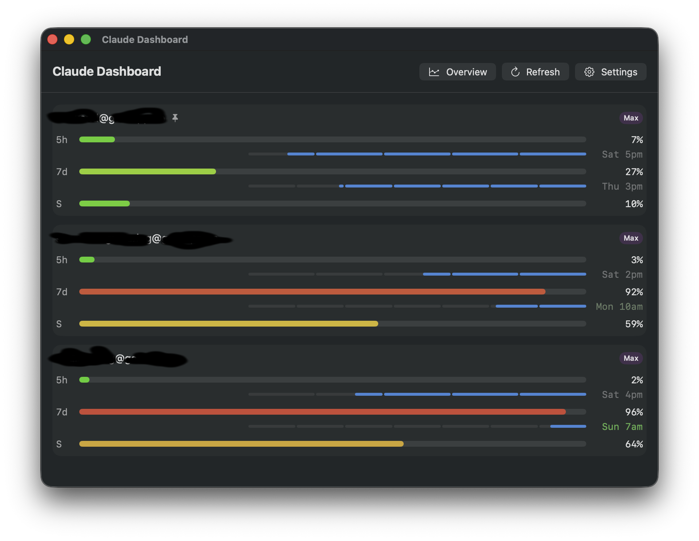
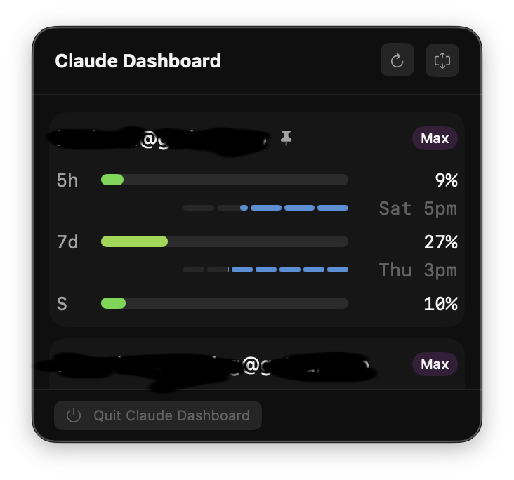
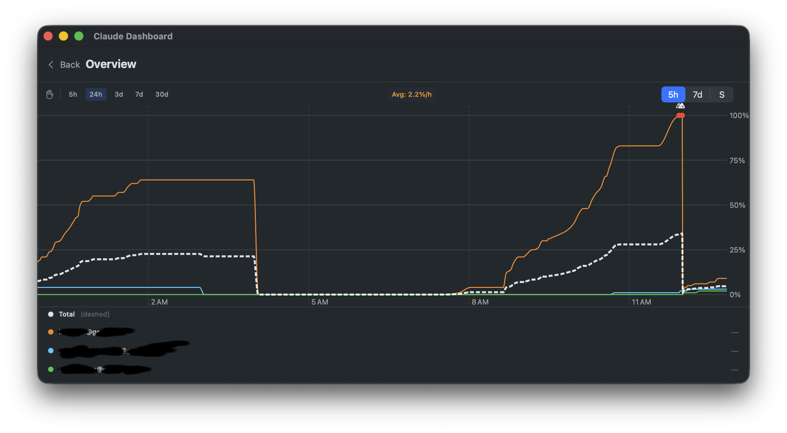
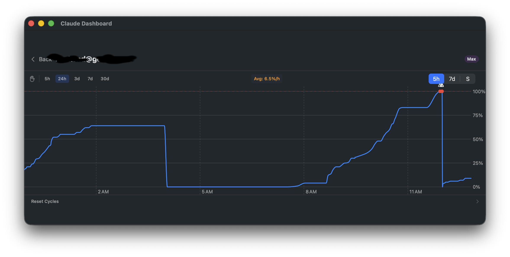

# Claude Dashboard

A macOS menu bar app that monitors your Claude.ai token usage across multiple accounts in real-time.



## Features

- **Multi-account monitoring** — Track usage across multiple Claude.ai accounts simultaneously
- **Menu bar quick view** — See usage at a glance without opening a window
- **Burn-rate sorting** — Accounts sorted by burn rate so you know which ones need attention
- **Interactive charts** — Visualize usage trends over time with zoomable charts (5h, 24h, 3d, 7d, 30d)
- **Reset cycle tracking** — See when your usage limits reset with countdown bars
- **Plan detection** — Automatically detects Pro, Max 5x, and Max 20x plans
- **Color-coded progress** — Green-to-red bars show utilization at a glance
- **Zero dependencies** — Pure native Swift (SwiftUI, AppKit, Combine)

## Screenshots

| Menu Bar Popover | Dashboard Window |
|:---:|:---:|
|  |  |

| Overview Chart | Account Detail |
|:---:|:---:|
|  |  |

## Installation

### Homebrew (recommended)

```bash
# Menu bar app
brew install --cask haiz/claude-dashboard/claude-dashboard

# Terminal CLI
brew install haiz/claude-dashboard/claude-dashboard-cli
```

### One-liner

```bash
curl -fsSL https://raw.githubusercontent.com/haiz/claude-dashboard/main/install.sh | bash
```

### Manual Download

1. Go to the [latest release](https://github.com/haiz/claude-dashboard/releases/latest)
2. Download `ClaudeDashboard.app.zip`
3. Extract and move `ClaudeDashboard.app` to `/Applications`
4. Right-click the app and select **Open** (first time only, since the app is unsigned)

## Terminal CLI

A terminal dashboard is available via the `claude-dashboard-cli` Homebrew formula. It reuses the same account storage as the menu bar app.

```bash
# One-time: scan Chrome profiles and save accounts
claude-dashboard-cli sync

# Live dashboard (refreshes every 5 minutes)
claude-dashboard-cli

# Render once and exit
claude-dashboard-cli --once
```

## Requirements

- macOS 13.0 (Ventura) or later
- Google Chrome (for automatic session key extraction)

## How It Works

1. Reads Claude.ai session cookies from Chrome's encrypted cookie database
2. Stores session keys securely in macOS Keychain
3. Fetches usage data from Claude.ai's API
4. Displays real-time utilization with burn-rate-based sorting

> **Note:** The app requires access to Chrome's cookie database and Keychain. App Sandbox is disabled for this reason.

## Build from Source

Requires Xcode 16.3+ and [XcodeGen](https://github.com/yonaskolb/XcodeGen).

```bash
# Install XcodeGen (if needed)
brew install xcodegen

# Clone and build
git clone https://github.com/haiz/claude-dashboard.git
cd claude-dashboard
xcodegen generate
xcodebuild -project ClaudeDashboard.xcodeproj -scheme ClaudeDashboard -configuration Release build

# The built app is in DerivedData
open ~/Library/Developer/Xcode/DerivedData/ClaudeDashboard-*/Build/Products/Release/ClaudeDashboard.app
```

## License

MIT
