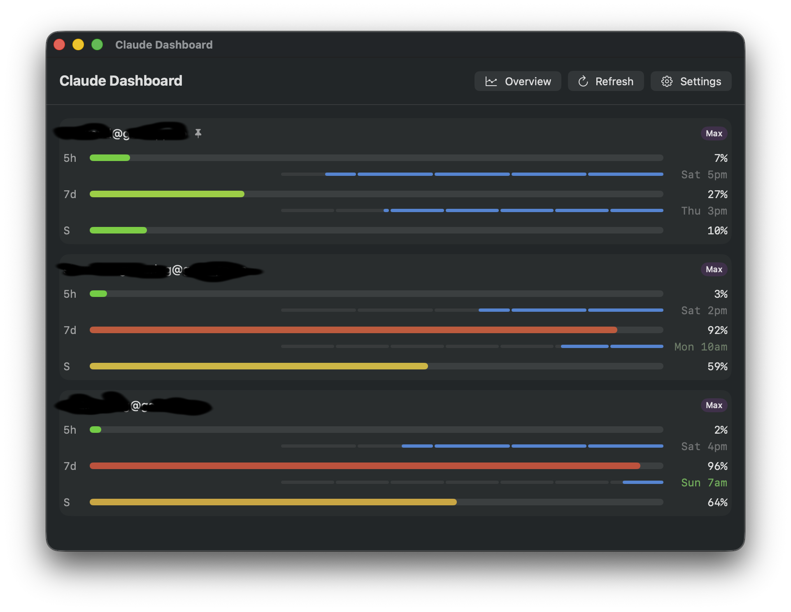
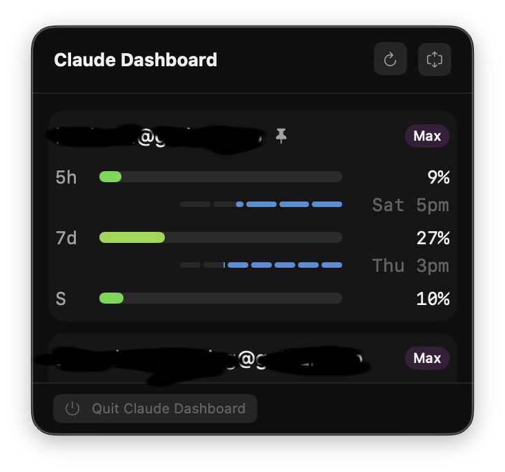
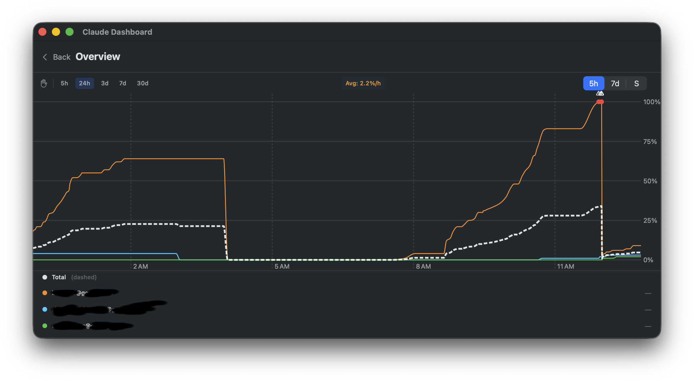
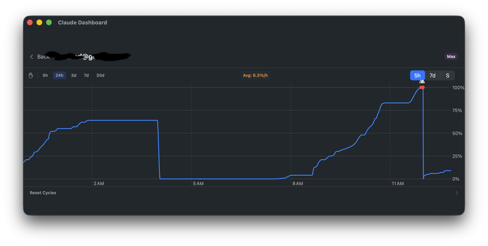
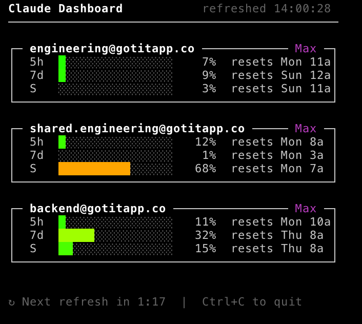

# Claude Dashboard

A macOS menu bar app that monitors your Claude.ai token usage across multiple accounts in real-time.



## Features

- **Multi-account monitoring** — Track usage across multiple Claude.ai accounts simultaneously
- **Menu bar quick view** — See usage at a glance without opening a window
- **Burn-rate sorting** — Accounts sorted by burn rate so you know which ones need attention
- **Interactive charts** — Visualize usage trends over time with zoomable charts (5h, 24h, 3d, 7d, 30d)
- **Reset cycle tracking** — See when your usage limits reset with countdown bars
- **Plan detection** — Detects Pro and Max plans from the account's org capabilities
- **Color-coded progress** — Green-to-red bars show utilization at a glance
- **Zero dependencies** — Pure native Swift (SwiftUI, AppKit, Combine)

## Screenshots

| Menu Bar Popover | Dashboard Window |
|:---:|:---:|
|  |  |

| Overview Chart | Account Detail |
|:---:|:---:|
|  |  |

## Repository Layout

```
apps/macos/       SwiftUI menu bar app, tests, and the Swift helper binary
apps/linux/       Rust workspace: the shared core plus the Linux helper binary.
                  Drives the same bash CLI; no GUI and no release yet.
contract/         Behaviour shared across platforms: docs plus executable cases
cli/              claude-dashboard-cli — the bash terminal dashboard
scripts/          release, version sync
Formula/ Casks/   Homebrew tap (must stay at the repo root)
install.sh        one-liner installer (published URL, must stay at the repo root)
```

## Installation

### Homebrew (recommended)

```bash
# Menu bar app
brew install --cask haiz/claude-dashboard/claude-dashboard

# Terminal CLI
brew install haiz/claude-dashboard/claude-dashboard-cli
```

### One-liner

```bash
curl -fsSL https://raw.githubusercontent.com/haiz/claude-dashboard/main/install.sh | bash
```

### Manual Download

1. Go to the [latest release](https://github.com/haiz/claude-dashboard/releases/latest)
2. Download `ClaudeDashboard.app.zip`
3. Extract and move `ClaudeDashboard.app` to `/Applications`
4. Right-click the app and select **Open** (first time only, since the app is unsigned)

## Terminal CLI

A terminal dashboard is available via the `claude-dashboard-cli` Homebrew formula. It reuses the same account storage as the menu bar app — so after `sync`, every account shows up in both the GUI and the terminal.



### Quick Start

```bash
# 1. Install
brew install haiz/claude-dashboard/claude-dashboard-cli

# 2. Scan installed browsers for Claude sessions and save accounts
claude-dashboard-cli sync

# 3. Launch the live dashboard
claude-dashboard-cli
```

`sync` opens the cookie database of every installed supported browser (Chrome, Arc, Brave, Edge), validates each session against the Claude.ai API, detects the plan (Pro or Max), and saves the accounts to `~/Library/Preferences/com.claude-dashboard.app.plist` (shared with the menu bar app).

### Commands

| Command | Description |
|---------|-------------|
| `claude-dashboard-cli` | Launch the live dashboard (default: refresh every 5 min) |
| `claude-dashboard-cli sync` | Re-scan the installed browsers and add any new accounts |
| `claude-dashboard-cli --once` | Render the dashboard once and exit (useful for scripts) |
| `claude-dashboard-cli --interval <sec>` | Change the refresh interval (e.g. `--interval 60`) |
| `claude-dashboard-cli --no-color` | Disable ANSI colors |
| `claude-dashboard-cli --version` | Print the CLI version |
| `claude-dashboard-cli --help` | Show help |

### What each row means

Each account card shows up to three usage bars:

- **5h** — 5-hour rolling window utilization
- **7d** — 7-day rolling window utilization
- **F** — Fable weekly window utilization (only when the account has one)

The `resets` column shows when each window resets (local time). Progress bars transition green → yellow → red as utilization approaches 100%. A card whose session has expired shows a status line in place of the bars.

### Tips

- Re-run `claude-dashboard-cli sync` whenever you log into a new Claude account in a supported browser, or after a session expires.
- To manage accounts (add, delete, re-sync), open the menu bar app — both share the same storage.
- Press `Ctrl+C` to quit the live dashboard.

## Requirements

- macOS 13.0 (Ventura) or later
- One of Google Chrome, Arc, Brave, or Microsoft Edge (for automatic session key extraction)

## How It Works

1. Reads Claude.ai session cookies from a supported browser's encrypted cookie database (Chrome, Arc, Brave, or Edge)
2. Encrypts session keys with AES-GCM (key derived from the machine's hardware UUID) and stores them in the app's preferences
3. Fetches usage data from Claude.ai's API
4. Displays real-time utilization with burn-rate-based sorting

> **Note:** The app requires access to the browser's cookie database and Keychain (that browser's Safe Storage password). App Sandbox is disabled for this reason.

## Build from Source

Requires Xcode 16.3+ and [XcodeGen](https://github.com/yonaskolb/XcodeGen).

```bash
# Install XcodeGen (if needed)
brew install xcodegen

# Clone and build
git clone https://github.com/haiz/claude-dashboard.git
cd claude-dashboard
(cd apps/macos && xcodegen generate)
xcodebuild -project apps/macos/ClaudeDashboard.xcodeproj -scheme ClaudeDashboard -configuration Release build

# The built app is in DerivedData
open ~/Library/Developer/Xcode/DerivedData/ClaudeDashboard-*/Build/Products/Release/ClaudeDashboard.app
```

## License

MIT
